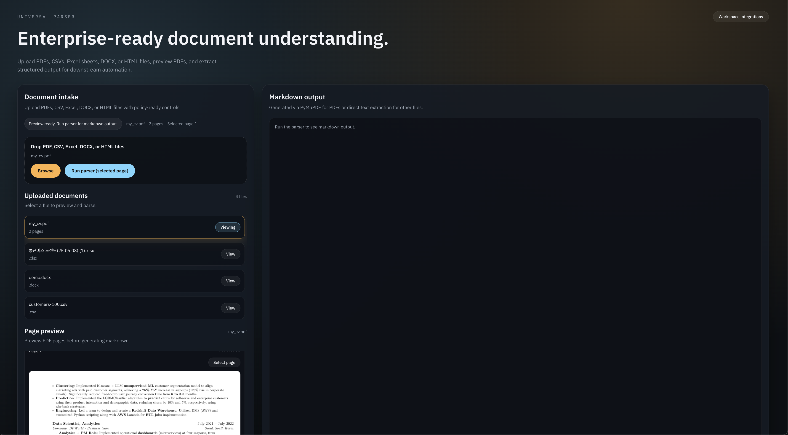

# UniversalParser

MVP for parsing PDFs with FastAPI and a lightweight static frontend.



## Stack
- Backend: FastAPI + PyMuPDF + pymupdfllm
- Frontend: static HTML + vanilla JS + PDF.js preview

## Backend setup (pip + venv)
```bash
python3 -m venv .venv
. .venv/bin/activate
pip install -r requirements.txt
```

Optional: install pymupdfllm if you have a source/registry available. Without it, the backend falls back to PyMuPDF text extraction.
```bash
pip install pymupdfllm
```

## Backend run
```bash
uvicorn main:app --reload --app-dir backend
```

## Frontend setup (npm)
```bash
cd frontend
npm install
```

## Frontend run (dev)
```bash
cd frontend
npm run dev
```

## Frontend run (start)
```bash
cd frontend
npm start
```

Open `http://localhost:5173` for the frontend and `http://localhost:8000` for the API.

To point the frontend at another API URL, set `VITE_API_BASE` before running `npm run dev`.

## Environment
Copy `.env.example` to `.env` and update values as needed. The backend reads this file on startup.

To enable non-PDF parsing via vLLM or Bedrock, set:
```
UP_LLM_ENABLED=true
UP_LLM_PROVIDER=openai_compatible  # or bedrock
UP_LLM_BASE_URL=http://localhost:8001
UP_LLM_MODEL=your-model
```
